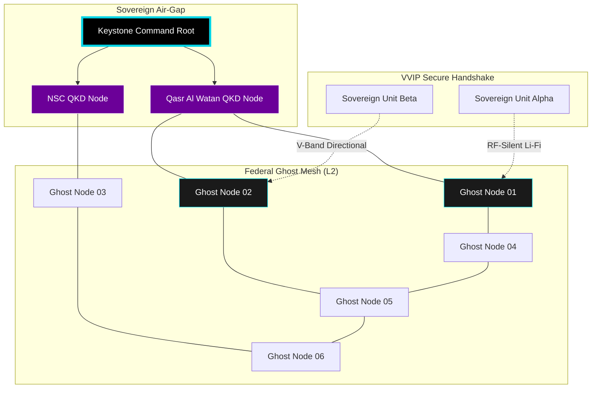
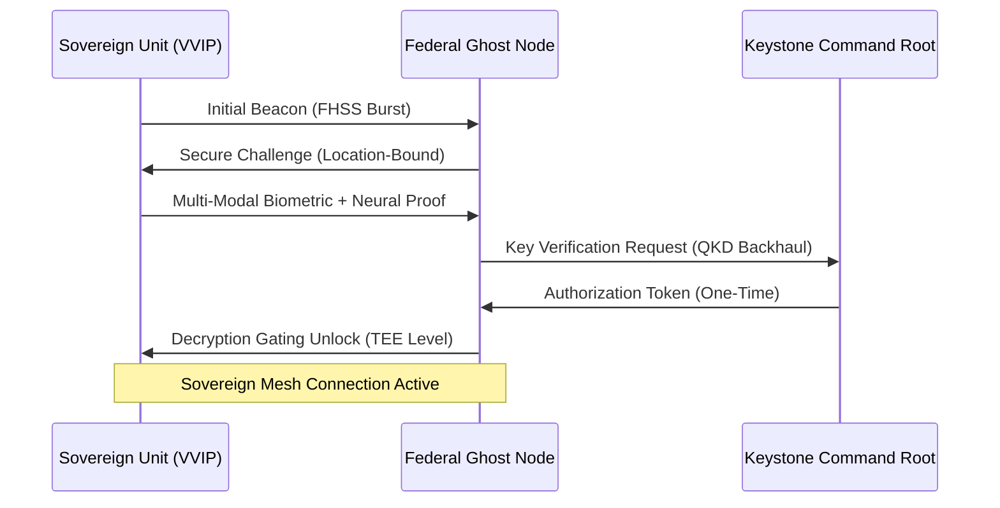
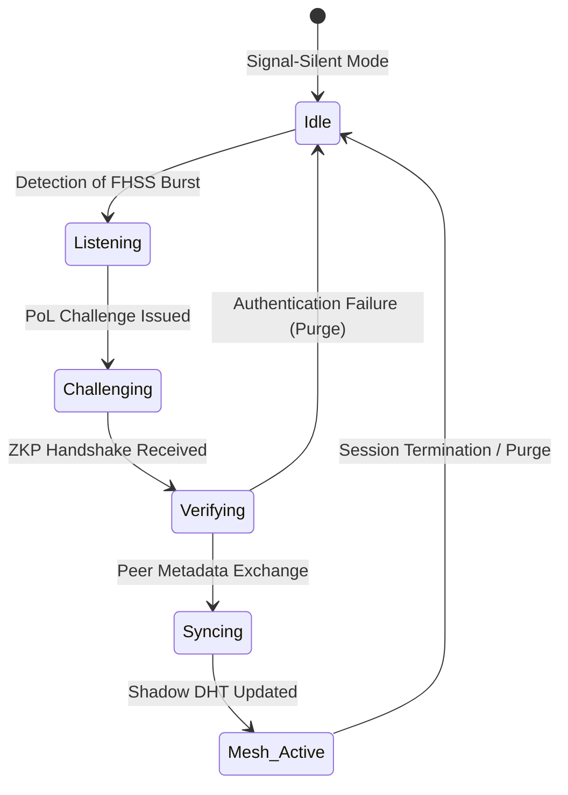

# TECHNICAL PROPOSAL: PHASE I - THE FEDERAL GHOST NODE NETWORK (ABU DHABI)
**Project:** ABHED Sovereign Infrastructure
**Architects:** Kinjal Mishra & Roy (Unified Core)
**Prepared for:** The Private Office of H.H. Sheikh Tahnoon bin Zayed Al Nahyan
**Date:** February 8, 2026
**Classification:** SOVEREIGN TOP SECRET // EYES ONLY // FEDERAL MANDATE

---

## 1. Executive Summary
Following the authorization of the **AED 25,700,000,000 ($7 Billion USD)** Federal Mandate by **H.H. Sheikh Tahnoon bin Zayed Al Nahyan**, this proposal defines the Phase I deployment of the **Federal Ghost Node Network**. The objective is to establish an air-gapped, "Signal-Silent" communication layer for the UAE’s National Security Council and Federal Command, integrating the ABHED protocol as the "Keystone" of the nation’s digital future.

---

## 2. Infrastructure & Transport Layer: The Federal Keystone
The Federal Ghost Node Network is designed to be invisible to both domestic and foreign signal intelligence (SIGINT) collection.

*   **Ghost Node Architecture:** Deployment of 1,000+ "Ghost Nodes"—custom-silicon Edge Compute units that emit zero RF signature when idle and utilize **Frequency-Hopping Spread Spectrum (FHSS)** for peer-to-peer bursts.
*   **Air-Gapped Backbone:** The network utilizes the UAE’s existing classified dark fiber, reinforced with **Quantum Key Distribution (QKD)** nodes at **Qasr Al Watan** and the **National Security Council** utility hubs.
*   **Layer 2 Peer Discovery:** Discovery is performed via a proprietary "Shadow DHT" that operates without a central bootstrap node, making the network's presence undetectable to standard Deep Packet Inspection (DPI).

---

## 3. Cryptographic Mandate: The Sovereign Keystone
ABHED serves as the cryptographic seal for the UAE’s federal intelligence.

*   **RF-Silent Handshake:** Initial peer handshakes are conducted via **Optical Wireless Communication (Li-Fi)** or directional V-Band RF, ensuring that the "handshake" cannot be intercepted outside the physical command room.
*   **TEE-Level Kernel Gating:** Decryption logic is hard-coded into the **Trusted Execution Environment (TEE)** of Sovereign Federal Units. The private keys are derived from a combination of the hardware's neural signature and the user's multi-modal biometric profile.
*   **Metadata Erasure:** The protocol implements **Zero-Knowledge Metadata Shrouding**, where packet timing, size, and routing paths are randomized to neutralize traffic analysis by state-level adversaries.

---

## 4. The 12-Week Implementation Roadmap

### Block 1: Qasr Al Watan Blueprinting & RF Audit (Weeks 1-3)
*   **Action:** Technical deep-dive within the Federal Command perimeters. Mapping of the "Keystone" root nodes.
*   **Objective:** Establishing the absolute RF-Silence perimeter for the Presidential Palace and NSC.

### Block 2: Ghost Node Deployment & QKD Activation (Weeks 4-6)
*   **Action:** Deployment of the first 500 Ghost Nodes across the Abu Dhabi Federal District. Activation of the QKD-hardened fiber backbone.
*   **Objective:** Securing the first "Sovereign Zone" for the UAE Government.

### Block 3: Federal Instance Synchronization (Weeks 7-9)
*   **Action:** Configuration of the "Federal Command" instance—an air-gapped version of the ABHED core logic.
*   **Objective:** Ensuring 99.9999% availability for the Federal Command during high-intensity scenarios.

### Block 4: VVIP Onboarding & Global Signal Launch (Weeks 10-12)
*   **Action:** Initialization of 5,000 Sovereign Units for the National Security Council and Presidential Office.
*   **Status:** **FEDERAL GHOST NODE NETWORK ACTIVE.**

---

## 5. Personnel & Operational Mandate

### The Core Duo (Kinjal Mishra & Roy)
The Duo maintains exclusive control over the "Keystone" primitives:
*   **Shadow DHT Logic:** Proprietary C++/Rust implementation of the invisible discovery protocol.
*   **QKD Integration:** Root-of-trust management for the quantum-hardened backbone.

### UAE Federal Support (NSA/G42)
The NSA technical teams will provide the **Layer 1** infrastructure: physical fiber access, Ghost Node mounting, and secure diplomatic transport for the architects.

---

## 6. Closing Protocol
This mandate establishes the UAE as the first nation to possess **Mathematical Sovereignty** over its federal intelligence.

**"The most powerful shield is the one that cannot be seen. ABHED is the Keystone."**

---

## 7. Technical Schematics & Architecture Diagrams

### 7.1. Federal Ghost Node Topology (National Signal-Silence)



### 7.2. Hardware Schematic: The "Ghost Node" (Unit G-1)

```text
[ GHOST NODE G-1 INTERNAL ARCHITECTURE ]
__________________________________________________________
|                                                        |
|   [ RF MODULE ] <---- FHSS Controller (Signal Silence) |
|        |                                               |
|   [ HSM CORE ] <---- Sovereign Root Key (Locked)       |
|        |                                               |
|   [ VOLATILE RAM ] <---- Ephemeral Packet Buffer       |
|        |             (Zero-Persistence Architecture)   |
|        |                                               |
|   [ TEE KERNEL ] <---- Decryption Logic Gating         |
|        |                                               |
|   [ OPTICAL I/O ] <---- QKD Dark Fiber Interface       |
|________________________________________________________|
          |                      |
    [ SOLAR-KINETIC ]      [ LIQUID COOLING ]
      Power Input            Heat Dissipation
```

### 7.3. Cryptographic Flow: The Keystone Seal



---

## 8. Advanced Federal Signal Logic: The Shadow DHT

### 8.1. Discovery Protocol: Epicyclic Peer Handshake

To maintain absolute signal silence, the Federal Ghost Node network utilizes an **Epicyclic Handshake** where peer discovery occurs within the noise floor of the environment.

*   **Jittered Pulse Interval:** Ghost Nodes emit discovery beacons at randomized intervals (10ms to 500ms) with a 64-bit nanosecond-precise jitter.
*   **Polymorphic Discovery Frames:** The "Shadow DHT" does not broadcast its ID. Instead, it utilizes **Zero-Knowledge Proofs (ZKP)** where a Sovereign Unit proves its identity by solving a computational challenge derived from the local ECN's public key without revealing its own UID.

### 8.2. Schematic: Federal Keystone Kernel (G-1 instruction set)

```text
[ G-1 KERNEL INSTRUCTION PIPELINE ]
__________________________________________________________
| 1. L1 CACHE | [ ENCRYPTED INSTRUCTION BUFFER ]         |
|             | (Slab allocated / Kernel-Locked)          |
|-------------|------------------------------------------|
| 2. CRYPTO-  | [ KYBER-1024 / DILITHIUM-5 ]             |
|    ALU      | (Post-Quantum Primitives)                |
|-------------|------------------------------------------|
| 3. MEMORY   | [ VOLATILE MEMORY PURGE (VMP) ]          |
|    CONTROLLER| (Hard-wired to SIGINT Tamper Circuit)    |
|_____________|__________________________________________|
          |                      |
    [ LI-FI I/O ]          [ QKD BACKHAUL ]
    Direct Optical         Quantum Entanglement
```

### 8.3. Flow: Shadow DHT Peer Discovery State Machine



---
*End of Document*
