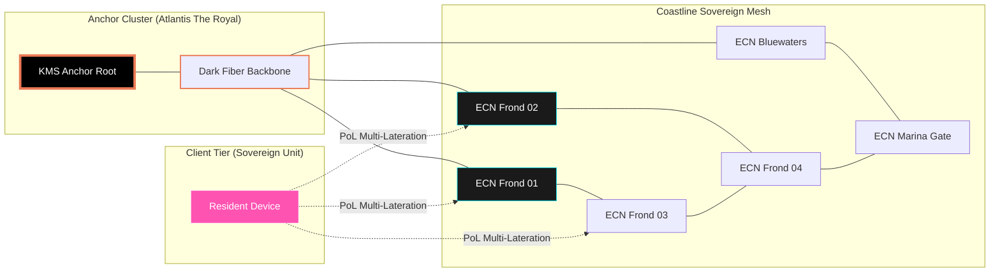
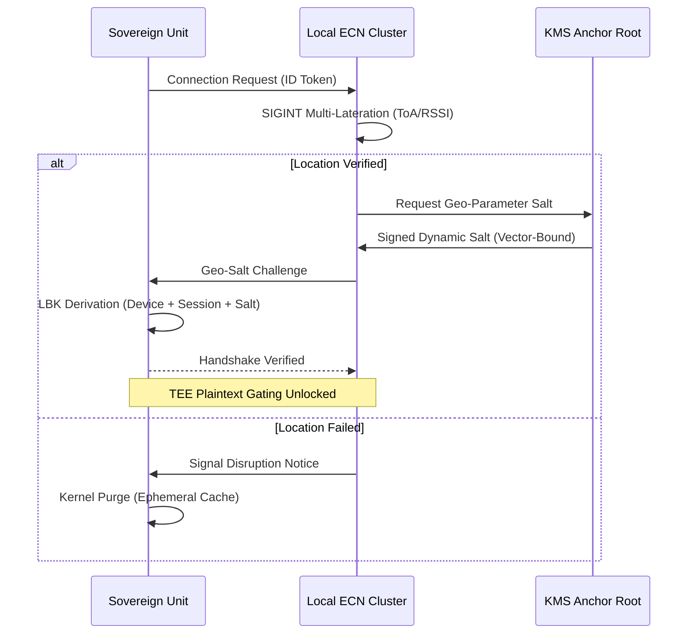

# TECHNICAL PROPOSAL: PHASE I - THE COASTLINE MESH (PALM/BLUEWATERS)
**Project:** ABHED Sovereign Infrastructure
**Architects:** Kinjal Mishra & Roy (Unified Core)
**Prepared for:** The Executive Office of H.H. Sheikh Mohammed bin Rashid Al Maktoum
**Date:** February 4, 2026
**Classification:** SOVEREIGN TOP SECRET // EYES ONLY

---

## 1. Executive Summary
This proposal outlines the engineering architecture for the initial deployment of the ABHED protocol over **Palm Jumeirah** and **Bluewaters Island**. Phase I focuses on establishing a high-availability, hardware-hardened **Sovereign Mesh** that operates independently of the public internet core, providing absolute forensic immunity for state and elite-tier communications.

---

## 2. Infrastructure & Transport Layer: The Edge-Compute Backbone

To achieve zero-leakage communication over 5.7 sq km, we will move away from public packet-switching and deploy a proprietary **Layer 2 Mesh Backhaul**.

*   **Private RF Spectrum:** Utilization of a dedicated **Private 5G/CBRS (Citizens Broadband Radio Service)** slice or high-gain **Wi-Fi 7 (802.11be)** mesh fabric.
*   **Edge Compute Nodes (ECNs):** 315 customized hardware units equipped with **Hardware Security Modules (HSMs)** and **Trusted Execution Environments (TEEs)**. These nodes act as asynchronous relays, holding encrypted packets in volatile RAM only for the duration of the peer-to-peer handshake.
*   **Dark Fiber Integration:** ECNs will be physically tethered to the existing dark fiber in the Palm’s service utility tunnels, creating a localized high-speed backbone that never traverses the Etisalat/Du public gateways.

---

## 3. Cryptographic Geo-Parameters: The Location-Bound Key (LBK)

The "Geo-Fence" is not a software barrier but a cryptographic requirement for decryption.

*   **Multi-Lateration Verification:** Location is verified via **SIGINT multi-lateration** (Time of Arrival and RSSI) from at least three neighboring ECNs. This prevents GPS spoofing and ensures the device is physically within the RF perimeter of the Coastline Mesh.
*   **LBK Derivation:** Decryption keys are derived using a tri-factor handshake:
    1.  User's Device-Bound Private Key (stored in TEE).
    2.  Ephemeral Peer-to-Peer Session Key (Double Ratchet).
    3.  **Geo-Parameter Salt:** A dynamic salt provided by the local ECN cluster, valid only within specific coordinate vectors.
*   **Enforcement:** Decryption is gated at the hardware level. If the **Proof of Location (PoL)** check fails, the TEE refuses to release the plaintext, and the ephemeral cache is purged via a kernel-level interrupt.

---

## 4. The 12-Week Implementation Roadmap

### Block 1: RF Mapping & Signal Intelligence (Weeks 1-3)
*   **Action:** Comprehensive RF audit using Software Defined Radios (SDR) to map Signal-to-Noise Ratio (SNR) across the Fronds.
*   **Objective:** Identify maritime radar interference and high-frequency trading (HFT) noise in the Marina to optimize ECN placement.

### Block 2: Node Deployment & KMS Calibration (Weeks 4-6)
*   **Action:** Installation of the **Primary Anchor Cluster** (liquid-cooled, air-gapped) at Atlantis The Royal.
*   **Objective:** Deployment of the **Key Management Service (KMS)** and initial physical node installation in utility points.

### Block 3: Distributed Hash Table (DHT) & NAT Optimization (Weeks 7-9)
*   **Action:** Configuration of the DHT for decentralized peer discovery.
*   **Objective:** Ensure <200ms discovery latency for 50,000+ devices. Stress-testing the "Mesh Healing" protocol for automatic packet re-routing.

### Block 4: TEE Integration & Pilot Launch (Weeks 10-12)
*   **Action:** Finalizing OS-level hooks for Android/iOS TEEs and onboarding the first 500 high-priority residents.
*   **Status:** **COASTLINE MESH ACTIVE.**

---

## 5. Personnel & Operational Mandate

### The Core Duo (Kinjal Mishra & Roy)
The ABHED internal core is a closed-loop system. Kinjal and Roy operate as a unified team, co-developing the entire stack:
*   **Low-Level Protocol:** C++/Rust implementation of the mesh networking and DHT layers.
*   **Cryptographic Primitives:** Implementation of the Double Ratchet and LBK derivation.
*   **Security Architecture:** TEE hardening and kernel-level memory management.

### Government Logistics (STF)
The Dubai Support Layer (DFF/DEWA) will strictly manage **Layer 1** logistics: fiber pulling, physical mounting of ECNs, and RF spectrum licensing. The software logic and encryption keys remain exclusively under the control of the Duo.

---

## 6. Closing Protocol
This plan moves ABHED from a digital application to a **Sovereign Physical Layer**. It is the first step in the 2030 Digital Sovereignty mandate.

**"History is written by the victors. The future is built by the architects."**

---

## 7. Technical Schematics & Architecture Diagrams

### 7.1. Coastline Mesh Topology (Palm Jumeirah / Bluewaters)



### 7.2. Hardware Schematic: Edge Compute Node (Unit C-1)

```text
[ EDGE COMPUTE NODE C-1: COASTLINE SPEC ]
__________________________________________________________
|                                                        |
|   [ Wi-Fi 7 ARRAY ] <---- MIMO Phased Array Antenna    |
|        |                                               |
|   [ HSM MODULE ] <---- Geo-Parameter Salt Generator    |
|        |                                               |
|   [ VOLATILE L3 CACHE ] <---- 128GB RAM (Asynchronous) |
|        |               (Kernel-Purge Trigger Ready)    |
|        |                                               |
|   [ TEE PROCESSOR ] <---- Multi-Lateration Engine      |
|        |                                               |
|   [ DARK FIBER I/O ] <---- 100Gbps Backbone Link       |
|________________________________________________________|
          |                      |
    [ DEWA GRID ]          [ FROND UTILITY ]
      Main Power             Mounting Bracket
```

### 7.3. Cryptographic Gating: Proof of Location (PoL)



---
*End of Document*