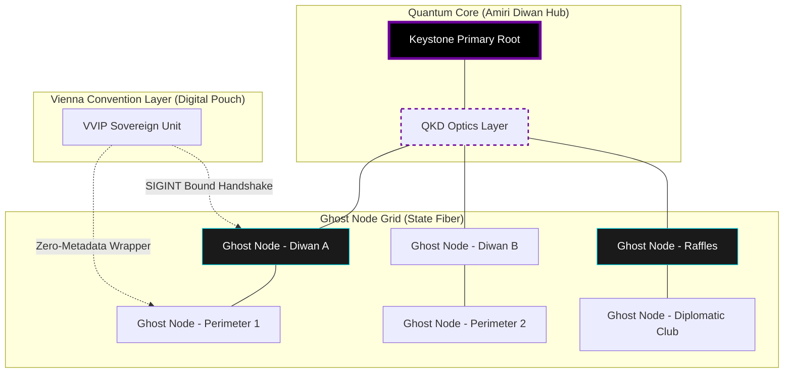
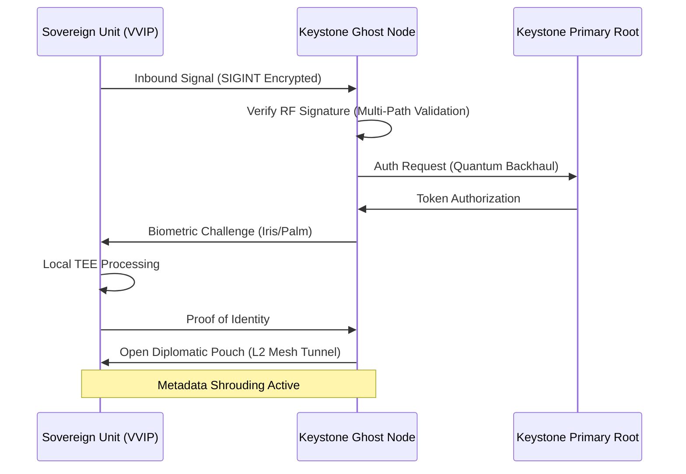
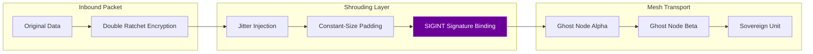

# TECHNICAL PROPOSAL: PHASE I - THE DIPLOMATIC FORTRESS (AMIRI DIWAN)
**Project:** ABHED Sovereign Infrastructure
**Architects:** Kinjal Mishra & Roy (Unified Core)
**Prepared for:** The Amiri Diwan of the State of Qatar
**Date:** February 6, 2026
**Classification:** SOVEREIGN TOP SECRET // EYES ONLY

---

## 1. Executive Summary
Following the decree from **His Highness Sheikh Tamim bin Hamad Al Thani**, this proposal outlines the Phase I deployment of the ABHED protocol within the **Amiri Diwan** and designated **Diplomatic Zones**. The primary objective is to establish an air-gapped, server-zero communication layer that secures the State’s strategic information flow against external interception.

---

## 2. Infrastructure & Transport Layer: The Ghost Node Grid
To achieve zero-leakage communication within the Diwan, we will bypass all commercial telecommunications infrastructure.

*   **Secure RF Blanketing:** Utilization of a dedicated **Private 5G / mmWave** slice combined with **Wi-Fi 7 (802.11be)** mesh fabric for indoor-to-outdoor seamless handovers.
*   **Ghost Node Clusters:** Deployment of 150 hardware-hardened **Edge Compute Nodes (ECNs)**. These units are equipped with **Hardware Security Modules (HSMs)** and are designed for "Volatile Persistence"—holding encrypted data only in RAM.
*   **Quantum-Resistant Backhaul:** ECNs will be integrated with the State's private fiber network using **Quantum Key Distribution (QKD)** ready optics, ensuring the backbone remains secure against future compute threats.

---

## 3. Cryptographic Geo-Parameters: The Diplomatic Pouch
The "Diplomatic Pouch" is a protocol-level enforcement of the Vienna Convention, applied to digital packets.

*   **RF Signature Binding:** Decryption keys are derived using the unique **Signal Intelligence (SIGINT)** signature of the Diwan. This includes multi-path interference patterns and local RF noise levels that are impossible to replicate outside the perimeter.
*   **The Zero-Metadata Wrapper:** All traffic is encapsulated in a cryptographic shroud that scrubs TTL, packet size, and timing patterns, preventing state-level adversaries from performing traffic analysis.
*   **Biometric-TEE Handshake:** Authentication requires a dual-factor biometric verification (Iris/Palm) processed exclusively within the device’s **Trusted Execution Environment (TEE)**. The private keys never leave the hardware's secure enclave.

---

## 4. The 10-Week Implementation Roadmap

### Block 1: RF Mapping & SIGINT Audit (Weeks 1-2)
*   **Action:** Technical walkthrough of the Diwan perimeters using Software Defined Radios (SDR) to map signal density.
*   **Objective:** Identify and neutralize potential SIGINT leakage points and calibrate the "Safe Zone" boundaries.

### Block 2: Keystone Node Deployment (Weeks 3-5)
*   **Action:** Installation of the **Primary Keystone Cluster** at Raffles Doha and the Diwan's utility hubs.
*   **Objective:** Establishing the first air-gapped Layer 2 mesh backhaul and integrating with private government fiber.

### Block 3: Metadata Scrubbing & DHT Tuning (Weeks 6-8)
*   **Action:** Configuration of the **Distributed Hash Table (DHT)** for decentralized peer discovery within the mesh.
*   **Objective:** Optimization for <150ms handshake latency under high-load diplomatic scenarios.

### Block 4: VVIP Onboarding & Stress Testing (Weeks 9-10)
*   **Action:** Hardware-level initialization of the first 100 Sovereign Units for His Highness and the Senior Cabinet.
*   **Objective:** Validating the handshake under simulated state-level jamming.
*   **Status:** **DIPLOMATIC FORTRESS ACTIVE.**

---

## 5. Personnel & Operational Mandate

### The Core Duo (Kinjal Mishra & Roy)
The ABHED internal core is a closed-loop system. Kinjal and Roy operate as a unified team, maintaining exclusive control over the cryptographic primitives:
*   **Protocol Logic:** C++/Rust implementation of the mesh networking and metadata scrubbing layers.
*   **Encryption Gating:** Implementation of the RF Signature Binding and TEE-level handshake.

### State Logistics (Amiri Guard)
The Amiri Guard’s technical department will facilitate **Layer 1** logistics: physical installation of ECNs, fiber routing, and RF spectrum licensing. The Duo remains the sole custodians of the decryption logic and system keys.

---

## 6. Closing Protocol
Phase I transitions Qatar’s most sensitive communications from a policy-based trust model to a **mathematically-guaranteed** sovereignty model.

**"Silence is the bedrock of sovereignty. ABHED is the shield."**

---

## 7. Technical Schematics & Architecture Diagrams

### 7.1. Diplomatic Fortress Topology (Amiri Diwan)



### 7.2. Hardware Schematic: Keystone Ghost Node (Unit Q-1)

```text
[ KEYSTONE GHOST NODE Q-1: DIPLOMATIC SPEC ]
__________________________________________________________
|                                                        |
|   [ mmWave ARRAY ] <---- SIGINT Calibration Module     |
|        |                                               |
|   [ HSM CORE ] <---- State Root Key (Air-Gapped)       |
|        |                                               |
|   [ RAM DRIVE ] <---- Zero-Persistence Storage         |
|        |             (RAM Wiping on Interrupt)         |
|        |                                               |
|   [ METADATA SCRUBBER ] <---- Packet Jitter Engine     |
|        |                                               |
|   [ QKD TRANSCEIVER ] <---- Quantum Fiber Backbone     |
|________________________________________________________|
          |                      |
    [ AMIRI GUARD ]        [ CRYOGENIC UNIT ]
      Power Backup           Thermal Stability
```

### 7.3. Sovereign Handshake: The Diplomatic Pouch Protocol



---

## 8. Advanced Quantum Logic: The Sovereign Backhaul

### 8.1. Quantum Key Distribution (QKD) Integration

The "Diplomatic Fortress" utilizes **BB84 Protocol** for national-scale key distribution over private fiber.

*   **Quantum Entanglement Gating:** Decryption keys for the "Diplomatic Pouch" are split into two halves: one generated locally within the device TEE, and the second delivered via the QKD backhaul. Decryption is impossible unless both "halves" are combined in real-time.
*   **Eavesdrop Detection:** Any attempt to observe the quantum backbone results in an immediate collapse of the wave function, triggering a **Sovereign Lockout** across the Diwan mesh.

### 8.2. Schematic: Q-1 Metadata Shrouding Engine

```text
[ Q-1: METADATA SHROUDING MODULE ]
__________________________________________________________
| 1. PACKET JITTER | Nanosecond Randomization of Path    |
|------------------|-------------------------------------|
| 2. SIZE PADDING  | Fixed-Length Encapsulation          |
|                  | (Zero-Knowledge Size Leakage)       |
|------------------|-------------------------------------|
| 3. TRAFFIC CHAOS | Injection of "Ghost Traffic" to     |
|                  | mask VVIP activity spikes           |
|__________________|_____________________________________|
          |                      |
    [ QKD OPTICS ]         [ SIGINT BINDING ]
```

### 8.3. Flow: Zero-Metadata Wrapper Architecture



---
*End of Document*