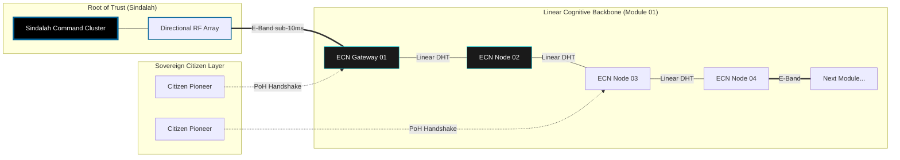
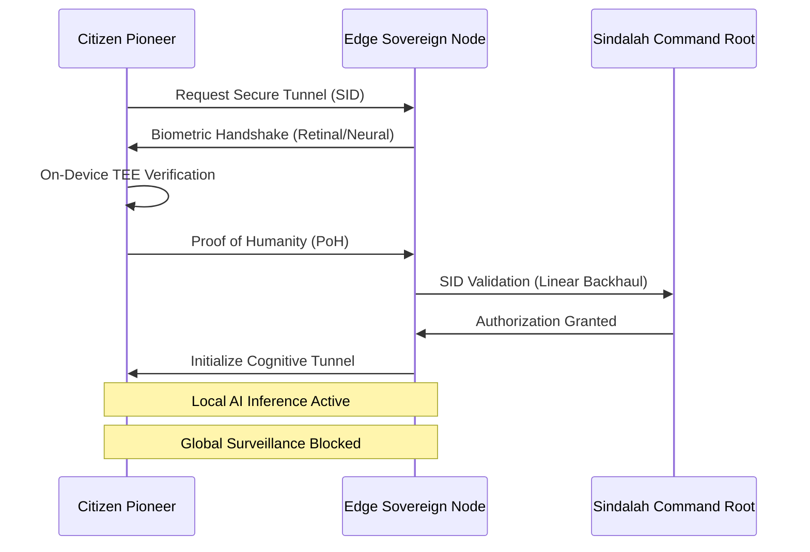
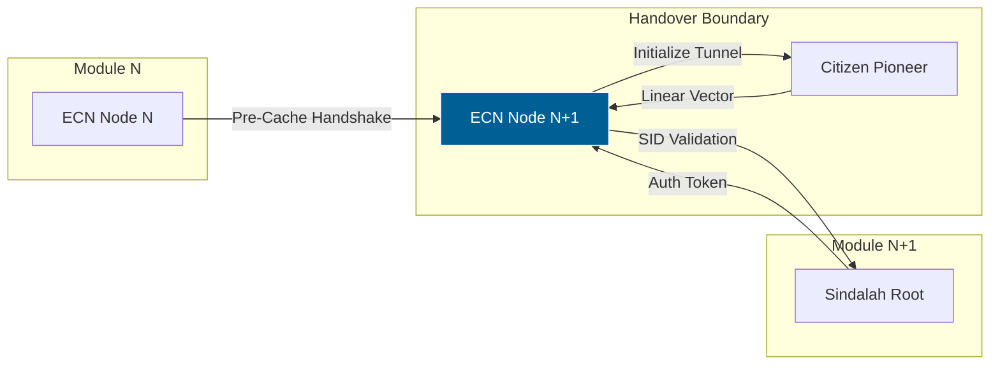

# TECHNICAL PROPOSAL: PHASE I - SOVEREIGN NODE INFRASTRUCTURE (NEOM)
**Project:** ABHED Sovereign Infrastructure
**Architects:** Kinjal Mishra & Roy (Unified Core)
**Prepared for:** The Private Office of HRH Crown Prince Mohammed bin Salman
**Date:** February 6, 2026
**Classification:** SOVEREIGN TOP SECRET // EYES ONLY

---

## 1. Executive Summary
This proposal defines the Phase I implementation of the ABHED protocol as the cognitive foundation for **NEOM** and **The Line**. Structured according to the initial tranches authorized by **HRH Crown Prince Mohammed bin Salman**, Phase I focuses on establishing the Sovereign Node infrastructure and the first pilot zone deployment.

---

## 2. Infrastructure Phasing: The Linear Mesh
To support the 170km straight-line geometry of **The Line**, Phase I deploys a non-traditional mesh architecture.

*   **Long-Range Directional RF Backhaul:** Utilization of **V-Band (60GHz) and E-Band (70/80GHz)** wireless backhaul links for ultra-low latency (sub-10ms) point-to-point data transport between modules.
*   **Sindalah Command Cluster:** Deployment of a Tier-4, liquid-cooled **Sovereign Node** backbone at Sindalah Island, serving as the air-gapped root of trust for the Kingdom's independent zones.
*   **Edge Compute Nodes (ECNs):** Integration of 500+ customized hardware units into the structural utility layers of the first 500-meter module of The Line. These ECNs process all peer discovery and handshake logic locally.

---

## 3. Cryptographic Identity: The Cognitive Tunnel
The ABHED protocol in NEOM operates as a "Cognitive Tunnel"—a secure, biometrically-gated conduit for data.

*   **Sovereign Identity (SID):** Every user is issued a hardware-bound **Sovereign Identity** that exists only within the device’s **Trusted Execution Environment (TEE)**. No central database holds user keys.
*   **Proof of Humanity (PoH):** Decryption is gated by a multi-modal biometric handshake (Retinal + Neural signature) processed at the hardware level. This ensures that only the biological owner can unlock the data "tunnel."
*   **Linear Topology DHT:** A customized **Distributed Hash Table (DHT)** optimized for linear discovery, preventing the broadcast storms typical of traditional 2D mesh networks.

---

## 4. The "Cognitive City" Layer: Post-Cloud Sovereignty
Phase I establishes NEOM as the world's first "Post-Cloud" environment.

*   **Zero-Interference Protocol:** All citizen data is physically bound to the device; the city "thinks" locally via distributed ECNs without a central brain or cloud dependency.
*   **The Sanctuary Protocol:** Protocol-level "Quiet Zones" designed to protect the user's cognitive bandwidth from algorithmic noise and external surveillance.
*   **Local Inference:** Deployment of localized AI inference containers within the device's "Digital Bunker," ensuring zero data leakage for cognitive assistant tasks.

---

## 5. The 12-Week Implementation Roadmap

### Block 1: Sindalah Setup & Linear RF Mapping (Weeks 1-3)
*   **Action:** Deployment of the Tranche 1 Command Cluster. Detailed RF mapping of the initial Line module using SDR arrays.
*   **Objective:** Calibrating directional backhaul links to ensure 99.999% uptime in desert environments.

### Block 2: TEE Kernel & SID Issuance (Weeks 4-6)
*   **Action:** Finalizing OS-level hooks for the NEOM-wide sovereign OS.
*   **Objective:** Initializing the "Secure Boot" chain and issuing the first 1,000 SIDs to Citizen Pioneers.

### Block 3: Distributed Hash Table (DHT) Optimization (Weeks 7-9)
*   **Action:** Stress-testing the linear DHT topology under simulated 170km scaling.
*   **Objective:** Ensuring <50ms peer discovery latency across the linear mesh.

### Block 4: Pilot Onboarding & Backbone Launch (Weeks 10-12)
*   **Action:** Onboarding the administrative core and activating the **Sanctuary Protocol**.
*   **Status:** **NEOM COGNITIVE BACKBONE ACTIVE.**

---

## 6. Personnel & Operational Mandate

### The Core Duo (Kinjal Mishra & Roy)
The Duo operates as the primary architects of the Sovereign Core. They maintain absolute control over:
*   **Directional Backhaul Logic:** Proprietary algorithms for linear packet routing and mesh healing.
*   **SID Management:** The root-of-trust logic for the TEE-level identity system.

### Saudi Technical Teams (G42/Oxagon)
The Saudi technical teams will manage **Layer 1** physical integration:
*   **Physical Deployment:** Mounting ECNs and aligning directional RF antennas.
*   **Power Harvesting:** Integration with solar-kinetic power grids to ensure autonomous ECN operation.

---

## 6. Closing Protocol
With the activation of Phase I, NEOM ceases to be a smart city and becomes a **Sovereign Intelligence**.

**"We do not build for the present. We architect the inevitable."**

---

## 7. Technical Schematics & Architecture Diagrams

### 7.1. Linear Mesh Topology (The Line / NEOM)



### 7.2. Hardware Schematic: Sovereign Node (Unit S-1)

```text
[ SOVEREIGN NODE S-1: NEOM SPEC ]
__________________________________________________________
|                                                        |
|   [ E-BAND ARRAY ] <---- Directional RF Backhaul       |
|        |                                               |
|   [ TEE KERNEL ] <---- SID Identity Root (Local)       |
|        |                                               |
|   [ AI NPU ] <---- Local Inference Container           |
|        |           (The Sanctuary Protocol)            |
|        |                                               |
|   [ L3 VOLATILE ] <---- Packet Routing Fabric          |
|        |                                               |
|   [ SOLAR-KINETIC ] <---- Power Harvesting I/O         |
|________________________________________________________|
          |                      |
    [ THE LINE GRID ]      [ DESERT HARDENING ]
      Kinetic Backup         Thermal Shielding
```

### 7.3. Cognitive Handshake: The Sanctuary Protocol



---

## 8. Advanced Cognitive Logic: The Linear Mesh Handover

### 8.1. Linear Topology Routing (LTR)

To maintain sub-10ms latency across 170km of **The Line**, the protocol utilizes a predictive linear handover.

*   **Anticipatory Peer Discovery:** ECNs predict the movement of Citizen Pioneers along the linear modules and pre-cache the **Ephemeral Handshake** at the next sequential node.
*   **E-Band Directional Polarization:** Backhaul links utilize dual-polarization (Vertical/Horizontal) to double the effective throughput and provide hardware-level redundancy against desert sandstorms.

### 8.2. Schematic: S-1 AI NPU (Sanctuary Engine)

```text
[ S-1: COGNITIVE SANCTUARY NPU ]
__________________________________________________________
|                                                        |
|   [ NEURAL BUFFER ] <---- Biometric Neural Signature   |
|        |                                               |
|   [ INFERENCE CORE ] <---- Sanctuary Logic (Local)     |
|        |             (Zero-Cloud Dependency)           |
|        |                                               |
|   [ ATTENTION GATE ] <---- Metadata Scrubbing Engine   |
|        |                                               |
|   [ LTR ROUTER ] <---- Directional RF Interface        |
|________________________________________________________|
          |                      |
    [ KINETIC GRID ]       [ TEE PERSISTENCE ]
```

### 8.3. Flow: The Line - Linear Mesh Handover State Machine



---
*End of Document*